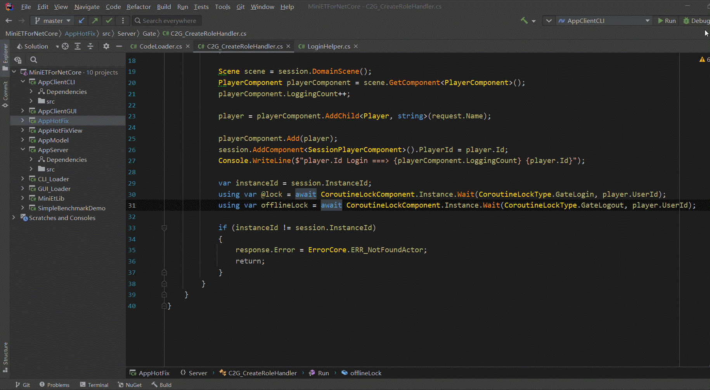
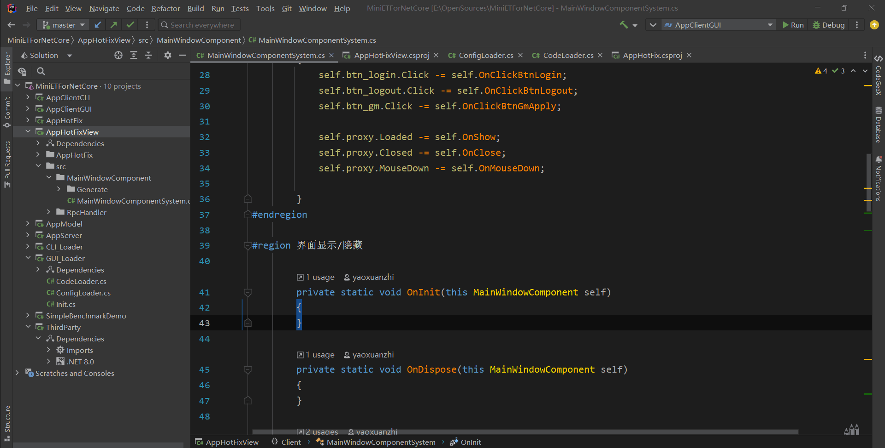
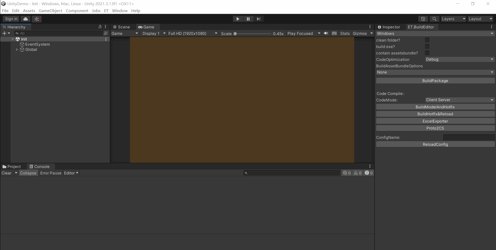
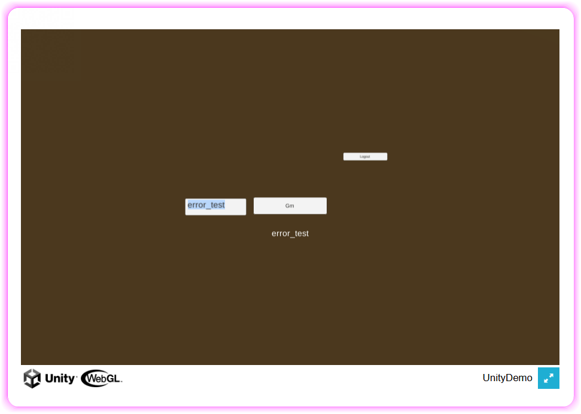

# MiniEtLibDemos

该仓库实际上是一个技术演示，本人裁剪整理Et核心层，得到了一个MiniEtLib类库，并将此作为成支持开发热重载、支持线上不停服热更新的双端开发框架基底

现已构建了包含WinForm GUI、UnityDemo在内的多个示例，方便大家参考

## 以下是一些主要的改动和调整
 - 删掉了绝大部分业务层逻辑，ET核心部分整理成一个类库，参考了[AOGame](https://github.com/m969/AOGame)
 - 引入Luban配置系统，提取自[X-ET7](https://github.com/IcePower/X-ET7)

# CLI热重载演示

# WinForm GUI热重载演示

# Unity热重载演示

# Unity WebGL示例

---

# 使用建议
若你的项目基于NetCore WinForm，例如希望为某应用添加一个支持动态加载的插件系统，可参考AppClientGUI示例，助你迅速实现目标，至于其开发热重载机制，已经被VS、Rider等IDE等工具完美支持了，这里就不再赘述了

若你身处Unity游戏项目，计划转向纯C#开发，可借鉴UnityDemo示例进行改造，以支持开发过程中的热重载。至于线上热更新，推荐使用[HybridCLR插件](https://github.com/focus-creative-games/hybridclr)

在网络方面，ET官方虽提供了一个简易的MMO分区分服Demo，但需要注意的是，此设计并非即插即用，Team Leader必须根据项目具体业务需求进行调整，因此，本人仅让MiniEtLib保留了CS通讯机制，而剔除了服务间通讯机制

实际上，不少开发团队还采用了消息中间件（如RabbitMq）来实现服务间通讯机制，若无特别需求，直接沿用ET框架原有的机制亦可，或进一步引入[Microsoft Orleans](https://github.com/dotnet/orleans)，亦不失为一种更好选择，这就看Team Leader的偏好了

# 后记
本人只是想要一个支持开发热重载，还能线上热更的c#双端开发框架，具体业务场景并未框定，它或许是一个WinForm GUI应用，亦或是一个Unity游戏，因此有了这个类库，理论上UE、Godot在接入C#支持后，也可以进行类似改造

最后，本人认为，前后端语言栈统一的最大收益，应该是公共库和重合业务代码的前后端复用，如果某个组件的数据还支持自动同步的话，那将会是绝杀

### 参考资料
 - [AOGame](https://github.com/m969/AOGame)
   >精简的ET核心层结构借鉴了它，但比它更加激进些